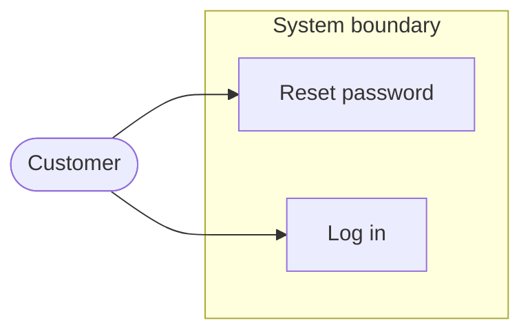
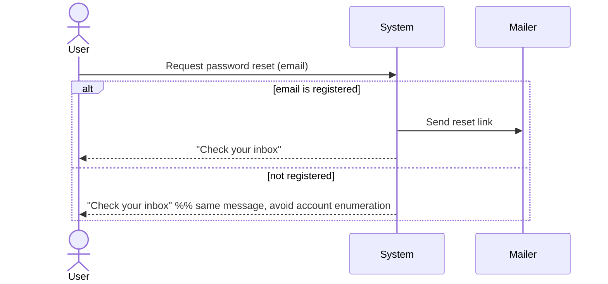
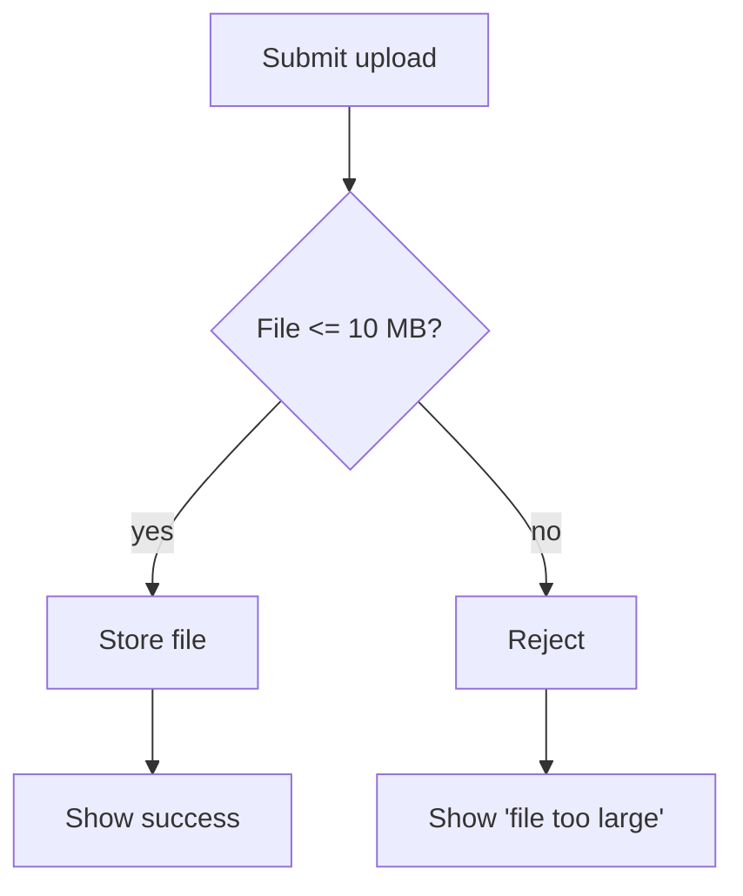
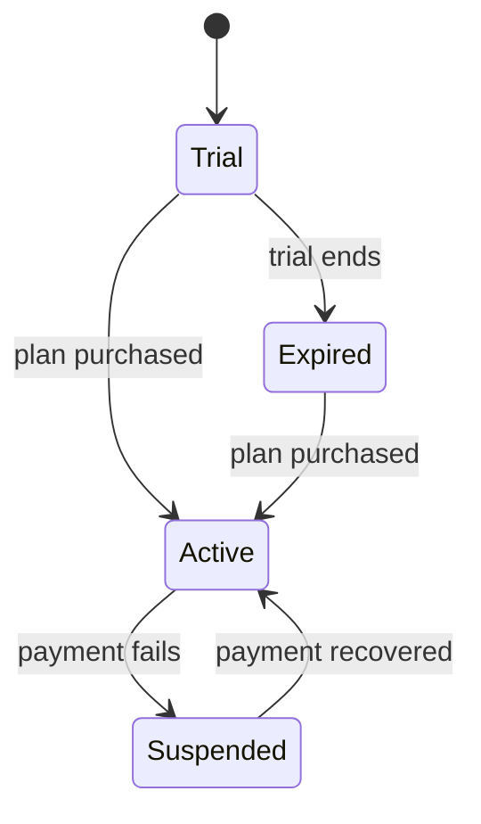
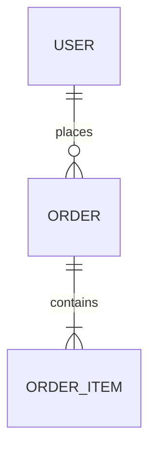
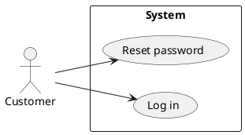
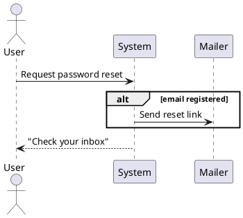

# Diagrams — diagram-as-code

Diagrams are produced as **text** (diagram-as-code) so they version, diff, and drop
into any target. Two rules govern them:

1. **Match the project's convention.** Detect it before choosing a notation:
   - `.puml` / `.plantuml` files, or a PlantUML server in CI → emit **PlantUML**.
   - ` ```mermaid ` fences in existing docs, a GitHub/GitLab wiki → emit **Mermaid**.
   - `.drawio` / `.excalidraw` → emit Mermaid that can be imported, and note it.
   - Nothing established → default to **Mermaid** (renders natively in GitHub
     issues and most Markdown viewers). Use PlantUML when you need true UML or a
     native use-case diagram.
2. **Only draw what clarifies this demand.** Don't emit all five by reflex. Pick
   from the selection guide.

## Selection guide (refinement artifact → diagram)

| You want to make clear…                          | Use                        |
|--------------------------------------------------|----------------------------|
| Who the actors are and what's in/out of scope    | Use-case diagram           |
| The order of interactions / an event flow        | Sequence diagram           |
| Decision logic, branches, error/edge paths       | Activity / flowchart       |
| An entity's lifecycle (your WHILE rules)          | State diagram              |
| The data the demand touches and its relations    | Class / ER diagram         |

Sequence diagrams map almost 1:1 onto event-driven (WHEN) rules and Given-When-Then
steps; activity diagrams are the natural home for the IF/THEN unwanted-behavior
branches.

## Mermaid snippets (portable default)

Use case (approximated with a graph — Mermaid has no native use-case type):


Sequence:


Activity / flowchart (decision + error branch):


State (lifecycle from WHILE rules):


ER (data touched):


## PlantUML snippets (when the project uses UML)

Use case (native):


Sequence:


PlantUML also covers activity (`start/if/endif/stop`), state, and class diagrams
with the same `@startuml … @enduml` wrapper.

## Practice

- Keep labels in the demand's language; keep them short.
- A diagram that contradicts a rule is a found bug — reconcile it, often by raising
  a question.
- Include the diagram source in the document; if the target can't render it, also
  attach/export an image (see output-targets.md).
